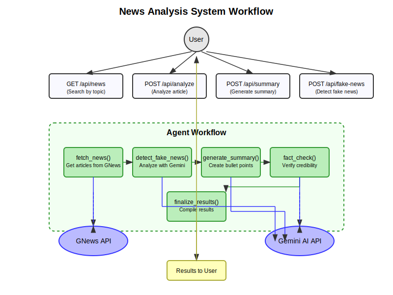

# PopNews Pulse Feed

A personalized AI-powered news aggregator that fetches, summarizes, and fact-checks news articles.

## Setup Instructions

### Prerequisites

- Python 3.8+
- Node.js 16+
- npm or yarn

### Installation

1. Install Python dependencies:

```bash
pip install flask flask-cors requests
```



# News Analysis System Workflow

## Overview

This system uses LangGraph, Flask, and external AI services to fetch, analyze, and fact-check news articles.

## API Endpoints

| Endpoint                   | Method | Description                             |
| -------------------------- | ------ | --------------------------------------- |
| `/api/news`                | GET    | Search news articles by topic           |
| `/api/analyze`             | POST   | Analyze a single article's credibility  |
| `/api/summary`             | POST   | Generate bullet-point summaries         |
| `/api/fake-news-detection` | POST   | Detect if an article contains fake news |

## Core Agent Workflow

The main processing workflow consists of five sequential steps:

1. **fetch_news()**:

   - Retrieves articles from GNews API based on search topic
   - Transforms articles into a standardized format
   - Handles errors from the API

2. **detect_fake_news()**:

   - Uses Gemini API to analyze article authenticity
   - Generates a fake news score (0-1)
   - Provides explanations for the score

3. **generate_summary()**:

   - Creates structured bullet-point summaries
   - Focuses on key insights, context, and significance
   - Uses Gemini API for natural language processing

4. **fact_check()**:

   - Performs detailed credibility analysis
   - Evaluates source verification and content issues
   - Provides reliability points and misinformation warnings

5. **finalize_results()**:
   - Compiles all analysis data into a complete response
   - Marks the process as completed

## External Dependencies

- **GNews API**: Source of news articles using API key `GNEWS_API_KEY`
- **Gemini AI API**: Google's generative AI model providing analysis capabilities
  - Uses model: gemini-1.5-flash
  - Accessed via API key `GEMINI_API_KEY`

## Data Flow

1. User submits request via one of the API endpoints
2. For full topic searches:
   - `process_topic()` orchestrates the complete workflow
   - All five agent functions run sequentially
3. For single article analysis:
   - The appropriate agent function is called directly
   - Results are returned to the user
4. External API calls are made as needed
5. Results are formatted as JSON and returned to the user

## Error Handling

- Each agent function contains error handling to ensure graceful failure
- Default values are provided when external APIs fail
- Errors are logged and returned to the client
